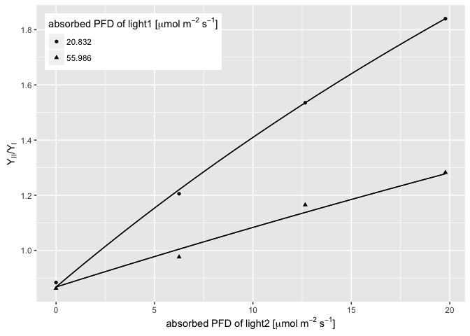

Overview
--------

[R](https://www.r-project.org/) code for quantification of excitation energy distribution between photosystems. For details on the method, please refer to the forthcoming paper ([Murakami et al., in press, *Plant, Cell & Environment*](https://doi.org/10.1111/pce.12986)).

PSII・PSI間での励起エネルギー分配を定量するためのスクリプトです。 [R](https://www.r-project.org/)言語で記述されています。 詳細は、([Murakami et al., in press, *Plant, Cell & Environment*](https://doi.org/10.1111/pce.12986)) を参照してください.

Dataset format
--------------

Reshape your data frame object as follows.

データフレームの形式を以下のように整形してください。

|  abs\_light1|  abs\_light2|  yield\_ps1|  yield\_ps2|
|------------:|------------:|-----------:|-----------:|
|       20.832|       0.0000|   0.8528182|   0.7536364|
|       20.832|       6.2511|   0.6350000|   0.7655000|
|       20.832|      12.6577|   0.4976667|   0.7640000|
|       20.832|      19.7796|   0.4152500|   0.7640000|
|       55.986|       0.0000|   0.8507500|   0.7336667|
|       55.986|       6.2511|   0.7685000|   0.7502500|
|       55.986|      12.6577|   0.6455000|   0.7520000|
|       55.986|      19.7796|   0.5822500|   0.7467500|

-   abs\_light1: absorbed photons of light1 \[µmol m<sup>-2</sup> s<sup>-1</sup>\].
-   abs\_light2: absorbed photons of light2 \[µmol m<sup>-2</sup> s<sup>-1</sup>\].
-   yield\_ps1: photochemical yield of PSI (= Y<sub>I</sub>).
-   yield\_ps2: photochemical yield of PSII (= Y<sub>II</sub>).

Demo
----

Apply `curve_fit` function to your data frame objects to show curve-fitting and estimated parameters.

`curve_fit`関数をデータフレームに適用すると、カーブフィッティングと分配パラメータが表示されます。

``` r
curve_fit(input_df)
```

    ## $curve_fitting


    ## 
    ## $Parameters
    ##       term  estimate   std.error statistic      p.value
    ## 1 f_light1 0.5368804 0.002718692 197.47744 1.137689e-12
    ## 2 f_light2 0.1587883 0.005759118  27.57163 1.505101e-07

Assuming 25% cyclic electron flow around PSI.

CEF-PSIの寄与を考慮する場合、以下のようにします。

``` r
curve_fit(input_df, cef_ps1 = 0.25)
```

    ## $curve_fitting



    ## 
    ## $Parameters
    ##       term  estimate   std.error statistic      p.value
    ## 1 f_light1 0.4797872 0.002584489 185.64105 1.648395e-12
    ## 2 f_light2 0.1168114 0.005295395  22.05906 5.672948e-07

Assuming 10% absorption by non-photosynthetic pigments.

光合成色素以外への成分への光吸収を考慮する場合、以下のようにします。

``` r
curve_fit(input_df, f_light1_npc = 0.10, f_light2_npc = 0.10)
```

    ## $curve_fitting


    ## 
    ## $Parameters
    ##       term  estimate   std.error statistic      p.value
    ## 1 f_light1 0.4831924 0.002446823 197.47744 1.137689e-12
    ## 2 f_light2 0.1429094 0.005183206  27.57162 1.505105e-07

Assuming both cyclic flow and non-photosynthetic pigments.

CEF-PSIおよび光合成色素以外への成分への光吸収のいずれをも考慮する場合、以下のようにします。

``` r
curve_fit(input_df, cef_ps1 = 0.25, f_light1_npc = 0.10, f_light2_npc = 0.10)
```

    ## $curve_fitting


    ## 
    ## $Parameters
    ##       term  estimate   std.error statistic      p.value
    ## 1 f_light1 0.4318085 0.002326040 185.64105 1.648395e-12
    ## 2 f_light2 0.1051303 0.004765855  22.05906 5.672949e-07

Installation
------------

    # if not installed,
    # install.packages("devtools")
    # install.packages("magrittr")
    # install.packages("tidyverse")
    # install.packages("broom")


    # type to load from gist

    devtools::source_url("https://gist.githubusercontent.com/KeachMurakami/eaa38a1ff0dd5d0369a6c0ca53e68326/raw/5440e25cc2c66d3a3d49d98a1dc4687c00b16c5b/excitation_energy_distribution")

    # or copy&paste lines.

    library(magrittr)
    library(tidyverse)
    library(broom)

Citation
--------

Murakami K., Matsuda R., Fujiwara K. (in press), “Quantification of excitation energy distribution between photosystems based on a mechanistic model of photosynthetic electron transport”, *Plant, Cell & Environment*. Vol. XXX, pp. XXX--YYY, doi: 10.1111/pce.12986.

Contact
-------

[Keach Murakami](https://keachmurakami.github.io/about/)

Session information
-------------------

    ##  setting  value                       
    ##  version  R version 3.3.1 (2016-06-21)
    ##  system   x86_64, darwin13.4.0        
    ##  ui       X11                         
    ##  language (EN)                        
    ##  collate  en_US.UTF-8                 
    ##  tz       Asia/Tokyo                  
    ##  date     2017-05-26                  
    ## 
    ##  package    * version date       source        
    ##  assertthat   0.1     2013-12-06 CRAN (R 3.3.1)
    ##  backports    1.0.4   2016-10-24 cran (@1.0.4) 
    ##  broom      * 0.4.1   2016-06-24 CRAN (R 3.3.0)
    ##  cellranger   1.1.0   2016-07-27 cran (@1.1.0) 
    ##  colorspace   1.2-6   2015-03-11 CRAN (R 3.3.1)
    ##  curl         0.9.7   2016-04-10 CRAN (R 3.3.1)
    ##  DBI          0.4-1   2016-05-08 CRAN (R 3.3.1)
    ##  devtools     1.12.0  2016-06-24 CRAN (R 3.3.0)
    ##  digest       0.6.11  2017-01-03 cran (@0.6.11)
    ##  dplyr      * 0.5.0   2016-06-24 CRAN (R 3.3.0)
    ##  evaluate     0.10    2016-10-11 cran (@0.10)  
    ##  forcats      0.2.0   2017-01-23 CRAN (R 3.3.2)
    ##  ggplot2    * 2.1.0   2016-03-01 url           
    ##  gtable       0.2.0   2016-02-26 CRAN (R 3.3.1)
    ##  haven        1.0.0   2016-09-23 CRAN (R 3.3.0)
    ##  highr        0.6     2016-05-09 CRAN (R 3.3.1)
    ##  hms          0.3     2016-11-22 CRAN (R 3.3.1)
    ##  htmltools    0.3.5   2016-03-21 CRAN (R 3.3.1)
    ##  httr         1.2.1   2016-07-03 CRAN (R 3.3.0)
    ##  jsonlite     1.2     2016-12-31 cran (@1.2)   
    ##  knitr      * 1.15.1  2016-11-22 cran (@1.15.1)
    ##  labeling     0.3     2014-08-23 CRAN (R 3.3.1)
    ##  lattice      0.20-33 2015-07-14 CRAN (R 3.3.1)
    ##  lazyeval     0.2.0   2016-06-12 CRAN (R 3.3.1)
    ##  lubridate    1.6.0   2016-09-13 CRAN (R 3.3.0)
    ##  magrittr   * 1.5     2014-11-22 CRAN (R 3.3.1)
    ##  memoise      1.0.0   2016-01-29 CRAN (R 3.3.1)
    ##  mnormt       1.5-4   2016-03-09 CRAN (R 3.3.0)
    ##  modelr       0.1.0   2016-08-31 CRAN (R 3.3.0)
    ##  munsell      0.4.3   2016-02-13 CRAN (R 3.3.1)
    ##  nlme         3.1-128 2016-05-10 CRAN (R 3.3.1)
    ##  plyr         1.8.4   2016-06-08 CRAN (R 3.3.1)
    ##  psych        1.6.6   2016-06-28 CRAN (R 3.3.0)
    ##  purrr      * 0.2.2   2016-06-18 CRAN (R 3.3.0)
    ##  R6           2.2.0   2016-10-05 cran (@2.2.0) 
    ##  Rcpp         0.12.10 2017-03-19 CRAN (R 3.3.2)
    ##  readr      * 1.0.0   2016-08-03 CRAN (R 3.3.0)
    ##  readxl       1.0.0   2017-04-18 cran (@1.0.0) 
    ##  reshape2     1.4.2   2016-10-22 cran (@1.4.2) 
    ##  rmarkdown    1.3     2016-12-21 cran (@1.3)   
    ##  rprojroot    1.2     2017-01-16 cran (@1.2)   
    ##  rvest        0.3.2   2016-06-17 CRAN (R 3.3.0)
    ##  scales       0.4.1   2016-11-09 CRAN (R 3.3.2)
    ##  stringi      1.1.2   2016-10-01 cran (@1.1.2) 
    ##  stringr      1.2.0   2017-02-18 cran (@1.2.0) 
    ##  tibble     * 1.3.0   2017-04-01 cran (@1.3.0) 
    ##  tidyr      * 0.6.1   2017-01-10 cran (@0.6.1) 
    ##  tidyverse  * 1.1.1   2017-01-27 cran (@1.1.1) 
    ##  withr        1.0.2   2016-06-20 CRAN (R 3.3.1)
    ##  xml2         1.1.1   2017-01-24 cran (@1.1.1) 
    ##  yaml         2.1.14  2016-11-12 cran (@2.1.14)
